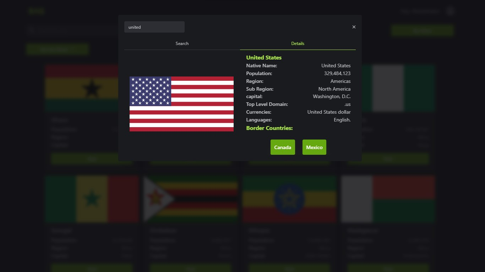

This project is deployed at https://bag-2022.herokuapp.com

## Brief:

This project uses a third-party API called [restcountries](https://restcountries.com) to fetch countries that allow users to explore and save any country to MongoDB (can register with unverified email). It also uses a RESTful API(CRUD Operation).

_Generated with [CRA](https://create-react-app.dev/) version 18.0.0._

## Frontend libraries used:

- Mantine
- ReactJS
- Redux (State Management & createAsyncThunk)
- React Router DOM
- Axios
- Lodash

## Backend libraries used:

- NodeJS
- Express
- JSON Web Token
- Bcrypt
- Joi (Check Validations)
- Mongoose

## Live: [bag](https://bag-2022.herokuapp.com)
